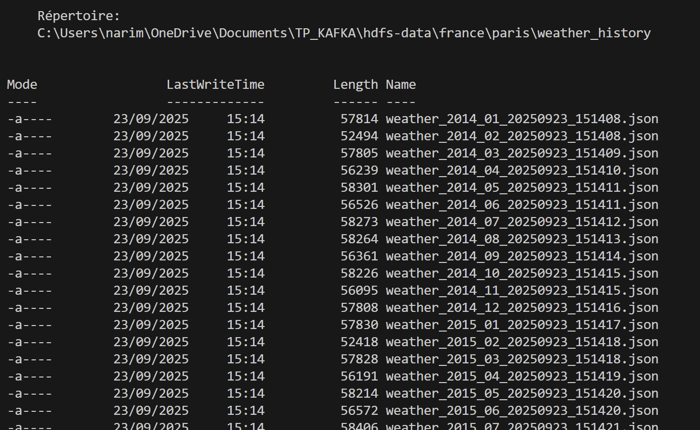
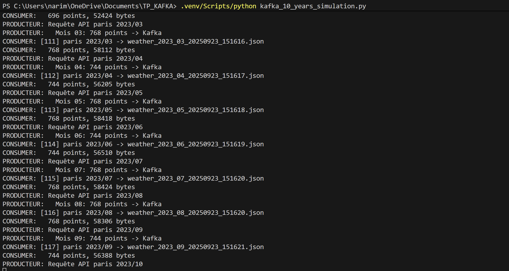

# Pipeline Météo Historique - Kafka 10 ans

## Objectif
Récupérer **10 ans de données météorologiques** (2014-2024) via API et les stocker avec Kafka.

## Scripts Essentiels

- **`simple_api_test.py`** - Test connexion API météo
- **`simple_producer.py`** - Récupère données → Kafka (Paris 2014-2024)
- **`simple_consumer.py`** - Kafka → Stockage HDFS  
- **`kafka_10_years_simulation.py`** - Pipeline complet simulé
- **`analyze_hdfs.py`** - Analyse des données stockées

## Flux du Pipeline

```
API Open-Meteo → Producer → Kafka → Consumer → HDFS Storage
```

## Utilisation Rapide

### Test simple
```bash
python simple_api_test.py
```

### Pipeline complet (avec Kafka)
```bash
# 1. Démarrer Kafka
docker-compose up -d

# 2. Consumer (terminal 1)
python simple_consumer.py

# 3. Producer 10 ans (terminal 2)
python simple_producer.py
```

### Simulation complète (sans Kafka)
```bash
python kafka_10_years_simulation.py
```

## Résultats Obtenus

### 📊 Données Récupérées
- **132 fichiers** (11 ans × 12 mois)
- **99,600 points météo** 
- **7.2 MB de données**
- **Structure organisée** par pays/ville



### 🔄 Pipeline en Action
Le pipeline traite automatiquement chaque mois de 2014 à 2024 :



### 📁 Structure HDFS Créée

```
hdfs-data/
└── france/
    └── paris/
        └── weather_history/
            ├── weather_2014_01_20250923_151408.json
            ├── weather_2014_02_20250923_151408.json
            ├── ...
            └── weather_2024_12_20250923_151635.json
```

### 📈 Performance
- **148 secondes** pour 10 ans complets
- **~754 points/mois** en moyenne
- **Température**: -1.5°C à 43.7°C sur la période
- **Variables**: température, humidité, vent, précipitations

## Analyse des Données

```bash
python analyze_hdfs.py
```

**Résultat exemple** :
```
RÉSUMÉ GLOBAL:
  Total fichiers: 132
  Points de données: 99,600
  Taille totale: 7.2 MB
  
DÉTAIL PAR ANNÉE:
  2014: 12 mois, 9,048 points, 668 KB
  2015: 12 mois, 9,048 points, 669 KB
  ...
  2024: 12 mois, 9,072 points, 670 KB
```

## Avantages

- **Automatique**: 10 ans récupérés en une commande
- **Organisé**: Structure HDFS claire 
- **Kafka**: Pipeline temps réel et scalable
- **Complet**: Données horaires sur décennie
- **Analysable**: Format JSON structuré

---

**Pipeline opérationnel** pour récupération massive de données météo historiques avec Kafka et stockage HDFS organisé.