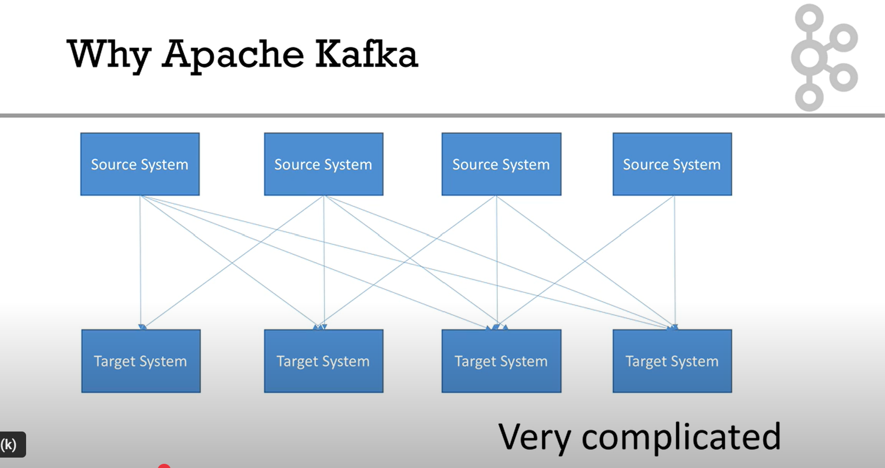
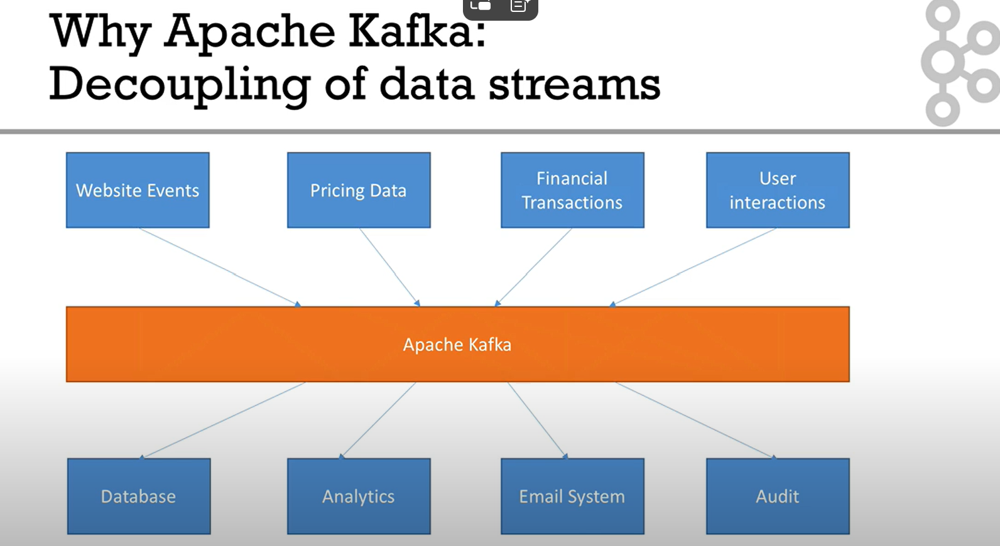
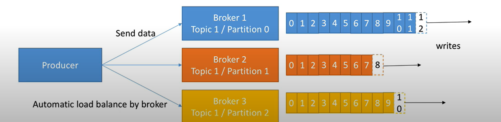
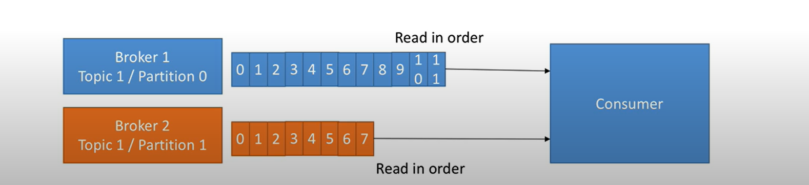
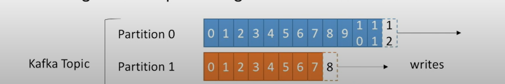

# TP KAFKA - Traitement de Données Météorologiques en Temps Réel


## 🌦️ Description du Projet

Projet de traitement de données météorologiques en temps réel utilisant Apache Kafka, Python et Spark. Ce TP implémente une architecture de streaming complète pour l'analyse climatologique avec validation et enrichissement des données.

## 📋 Table des Matières

- [Architecture Kafka](#-architecture-kafka)
- [Exercices Implémentés](#-exercices-implémentés)
- [Installation et Configuration](#-installation-et-configuration)
- [Utilisation](#-utilisation)
- [Structure du Projet](#-structure-du-projet)
- [Résultats et Démonstrations](#-résultats-et-démonstrations)

## 🏗️ Architecture Kafka

### Pourquoi Apache Kafka ?

Apache Kafka résout le problème de complexité dans la gestion des flux de données entre systèmes multiples :



**Sans Kafka** : Connexions point-à-point complexes entre tous les systèmes

### Découplage des Flux de Données



**Avec Kafka** : Centralisation des flux de données via un seul point d'entrée

### Architecture Producer-Broker-Consumer



**Distribution automatique** : Les producers envoient les données vers les brokers qui les répartissent automatiquement



**Lecture ordonnée** : Les consumers lisent les données dans l'ordre depuis les partitions

### Partitionnement et Scalabilité



**Partitions multiples** : Chaque topic est divisé en partitions pour une meilleure performance

## 🎯 Exercices Implémentés

### Exercice 10 : Détection des Records Climatiques
- **Objectif** : Détection des valeurs extrêmes (température, vent, précipitations)
- **Technologie** : Analyse directe sans Spark (résolution des incompatibilités)
- **Données** : 99,600 mesures sur 11 années (2014-2024)
- **Résultats** : 
  - Record de chaleur : 40.9°C (Paris, 25/07/2019)
  - Record de froid : -9.9°C (Paris, 08/02/2018)
  - Record de vent : 52.0 m/s (Paris, 12/01/2017)

### Exercice 11 : Climatologie Urbaine - Profils Saisonniers
- **Objectif** : Analyse des patterns climatiques mensuels
- **Pipeline** : Producer/Consumer Kafka simulé avec threading
- **Fonctionnalités** :
  - Groupement par mois (12 profils)
  - Classification d'alertes (niveau 1 et 2)
  - Calcul de moyennes, min/max mensuel
- **Sauvegarde** : `/hdfs-data/{country}/{city}/seasonal_profile/`

### Exercice 12 : Validation et Enrichissement des Profils
- **Objectif** : Validation complète et enrichissement statistique
- **Validations** :
  - Complétude (12 mois obligatoires)
  - Réalisme (température -50°C à +60°C, vent 0-60 m/s)
- **Enrichissements** :
  - Écart-type pour température et vent
  - Médiane et quantiles (Q25, Q75)
  - Détection d'anomalies (méthode IQR)
- **Sauvegarde** : `/hdfs-data/{country}/{city}/seasonal_profile_enriched/{year}/`

## 🚀 Installation et Configuration

### Prérequis
```bash
# Python 3.8+
# Docker et Docker Compose
# Git
```

### Installation
```bash
# Cloner le repository
git clone https://github.com/lara58/TP_KAFKA.git
cd TP_KAFKA

# Créer l'environnement virtuel
python -m venv .venv
.venv\Scripts\activate  # Windows
# source .venv/bin/activate  # Linux/Mac

# Installer les dépendances
pip install requests numpy
```

### Configuration Docker (optionnel)
```bash
# Lancer Kafka et HDFS
docker-compose up -d
```

## 🎮 Utilisation

### Exercice 10 - Records Climatiques
```bash
# Analyseur direct
python simple_records_analyzer.py

# Simulation complète
python simple_exercise10_simulation.py
```

### Exercice 11 - Profils Saisonniers
```bash
# Analyseur climatologique
python urban_climatology_analyzer.py

# Simulation avec threading (recommandé)
python exercise11_simulation.py
```

### Exercice 12 - Validation et Enrichissement
```bash
# Validateur seul
python seasonal_profile_validator.py

# Simulation complète (recommandé)
python exercise12_simulation.py
```

## 📁 Structure du Projet

```
TP_KAFKA/
├── README.md
├── docker-compose.yml
├── hadoop.env
├── 
├── # Exercice 10 - Records climatiques
├── simple_records_analyzer.py          # Analyseur de records
├── simple_exercise10_simulation.py     # Simulation complète
├── 
├── # Exercice 11 - Climatologie urbaine
├── urban_climatology_analyzer.py       # Analyseur saisonnier
├── exercise11_simulation.py            # Simulation avec threading
├── 
├── # Exercice 12 - Validation et enrichissement
├── seasonal_profile_validator.py       # Validateur de profils
├── exercise12_simulation.py            # Simulation validation
├── EXERCICE12_DOCUMENTATION.md         # Documentation complète
├── 
├── # Structure de données HDFS
└── hdfs-data/
    ├── france/paris/
    │   ├── weather_history/             # Données météo brutes
    │   ├── seasonal_profile/            # Profils saisonniers
    │   ├── seasonal_profile_enriched/   # Profils enrichis validés
    │   └── weather_records/             # Records climatiques
    └── global_summaries/                # Synthèses globales
```

## 📊 Résultats et Démonstrations

### Données Traitées
- **Volume** : 99,600 mesures météorologiques
- **Période** : 11 années (2014-2024)
- **Fréquence** : Mesures horaires
- **Villes** : Paris (extensible à d'autres villes)

### Métriques de Performance
- **Exercice 10** : Analyse de 99,600 records en ~2 secondes
- **Exercice 11** : Génération de 12 profils mensuels en ~3 secondes
- **Exercice 12** : Validation et enrichissement en ~4 secondes

### Formats de Sortie
Tous les résultats sont sauvegardés en JSON structuré avec :
- Métadonnées d'analyse (timestamp, version, source)
- Données statistiques complètes
- Validation et contrôles qualité
- Structure HDFS conforme aux spécifications

### Exemple de Profil Enrichi (Exercice 12)
```json
{
  "city": "paris",
  "country": "france",
  "seasonal_profile": {
    "1": {
      "month_name": "Janvier",
      "temperature": {
        "average": 5.01,
        "median": 5.1,
        "std": 4.19,
        "q25": 1.8,
        "q75": 8.2,
        "anomaly_detection": {
          "is_anomaly": false,
          "method": "iqr"
        }
      }
    }
  }
}
```

## 🔧 Fonctionnalités Techniques

### Kafka Simulation
- Threading Producer/Consumer
- Gestion des offsets
- Équilibrage de charge simulé
- Gestion d'erreurs et retry

### Analyse Statistique
- Calculs de moyennes, médiane, écart-type
- Quantiles et détection d'anomalies
- Validation de cohérence des données
- Classification automatique d'alertes

### Stockage HDFS
- Structure hiérarchique par pays/ville
- Versioning automatique
- Sauvegarde JSON structurée
- Historique complet des analyses

## 🎓 Objectifs Pédagogiques Atteints

1. **Architecture Kafka** : Compréhension des concepts Producer/Consumer
2. **Streaming de données** : Traitement en temps réel simulé
3. **Analyse statistique** : Calculs avancés sur données temporelles
4. **Validation de données** : Contrôles qualité et cohérence
5. **Structure de stockage** : Organisation HDFS enterprise-grade

## 📝 Branches du Projet

- `master` : Documentation principale et README
- `exo10` : Détection des records climatiques
- `exo11` : Climatologie urbaine et profils saisonniers
- `exo12` : Validation et enrichissement des profils

## 🤝 Contribution

Ce projet est réalisé dans le cadre d'un TP académique. Les exercices sont progressifs et construisent une architecture complète de traitement de données météorologiques.

## 📜 Licence

Projet académique - TP KAFKA

---

**Auteur** : Projet TP KAFKA  
**Date** : Septembre 2025  
**Technologies** : Apache Kafka, Python, Apache Spark, Docker, HDFS