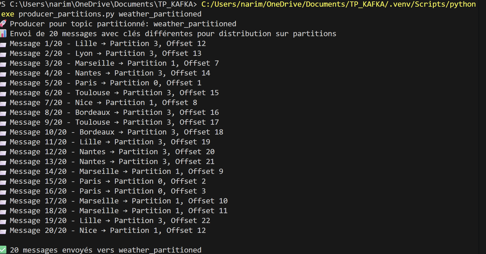
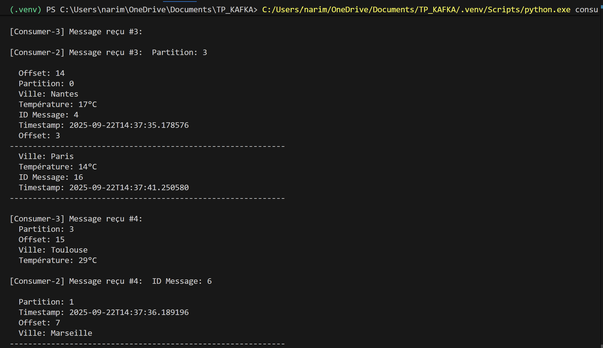

# Exercice 4 : Consumer Groups et Partitions Kafka

## Objectif
Comprendre et démontrer le fonctionnement des **Consumer Groups** et des **Partitions** dans Kafka.

## Concepts clés

### Consumer Groups
Un **Consumer Group** est un ensemble de consumers qui travaillent ensemble pour consommer un topic. Kafka distribue automatiquement les partitions du topic entre les consumers du groupe pour répartir la charge.

### Partitions
Les **Partitions** permettent de diviser un topic en plusieurs segments parallèles. Chaque partition est ordonnée et peut être traitée par un consumer différent.

## Avantages
- **Scalabilité** : Plus de consumers = plus de traitement parallèle
- **Résilience** : Si un consumer tombe, les autres continuent
- **Équilibrage automatique** : Kafka redistribue les partitions automatiquement

## Scripts de l'exercice 4

### 1. `setup_partitions.py`
Script pour créer et gérer des topics avec partitions.

**Fonctionnalités :**
- Créer un topic avec un nombre spécifié de partitions
- Lister tous les topics existants
- Décrire les détails d'un topic (partitions, réplication)

### 2. `producer_partitions.py`
Producer optimisé pour les topics partitionnés.

**Caractéristiques :**
- Utilise les noms de villes comme **clés de partitionnement**
- Distribue automatiquement les messages sur les partitions
- Affiche la partition de destination de chaque message

### 3. `consumer_group.py`
Consumer multi-threadé qui démontre les consumer groups.

**Fonctionnalités :**
- Lance plusieurs consumers dans le même groupe
- Chaque consumer traite des partitions différentes
- Affiche quelle partition chaque consumer traite
- Gestion propre de l'arrêt avec Ctrl+C

## Résumé des commandes

### 1. Créer un topic avec partitions
```bash
python setup_partitions.py weather_partitioned 4
```

### 2. Lister les topics
```bash
python setup_partitions.py list
```

### 3. Décrire un topic
```bash
python setup_partitions.py describe weather_partitioned
```

### 4. Envoyer des messages vers le topic partitionné
```bash
python producer_partitions.py weather_partitioned
```

### 5. Lancer des consumer groups
```bash
# Dans un terminal
python consumer_group.py weather_partitioned demo_group 3
```

### 6. Tester avec plusieurs groupes (optionnel)
```bash
# Dans un autre terminal - groupe différent
python consumer_group.py weather_partitioned other_group 2
```

## Sortie attendue

### Producer
```
Producer pour topic partitionné: weather_partitioned
Envoi de 20 messages avec clés différentes pour distribution sur partitions
Message 1/20 - Marseille → Partition 1, Offset 0
Message 2/20 - Toulouse → Partition 3, Offset 0
Message 3/20 - Paris → Partition 0, Offset 0
...
20 messages envoyés vers weather_partitioned
```

### Consumer Groups
```
Démarrage de 3 consumers pour le topic 'weather_partitioned'
Groupe de consumers: 'demo_group'
Chaque consumer va traiter des partitions différentes

[Consumer-1] Message reçu #1:
  Partition: 3
  Ville: Toulouse
  
[Consumer-2] Message reçu #1:
  Partition: 1
  Ville: Marseille

[Consumer-3] Message reçu #1:
  Partition: 0
  Ville: Paris
```

## Résultats des tests

### Test 1: Création du topic partitionné
```bash
python setup_partitions.py weather_partitioned 4
```
**Résultat :** Topic créé avec 4 partitions (0, 1, 2, 3) avec réplication factor = 1

### Test 2: Distribution des messages par le producer
```bash
python producer_partitions.py weather_partitioned
```
**Résultat observé :**
- 20 messages envoyés avec distribution automatique basée sur les clés (noms de villes)
- **Partition 0** : 3 messages (Paris)
- **Partition 1** : 6 messages (Marseille, Nice)  
- **Partition 2** : 0 message (normal selon hash des clés)
- **Partition 3** : 11 messages (Lille, Lyon, Nantes, Toulouse, Bordeaux)

### Test 3: Consumer Groups avec répartition automatique
```bash
python consumer_group.py weather_partitioned demo_group 3
```
**Résultat observé :**
- 3 consumers lancés dans le groupe "demo_group"
- Kafka a automatiquement assigné les partitions :
  - **Consumer-2** : Partition 0 + Partition 1
  - **Consumer-3** : Partition 3  
  - **Consumer-1** : Aucune partition assignée (plus de consumers que de partitions avec messages)

**Traitement parallèle confirmé :** Chaque consumer ne traite que les messages de ses partitions assignées.

## Cas d'usage réels
- **Microservices** : Plusieurs instances d'un service consomment le même topic
- **Traitement de données** : Parallélisation du traitement sur plusieurs machines
- **Monitoring** : Plusieurs dashboards consomment les mêmes métriques
- **ETL** : Extraction de données en parallèle depuis Kafka

## Points importants
- **1 partition = 1 consumer maximum** dans le même groupe
- Si plus de consumers que de partitions → certains consumers restent inactifs
- Les **clés de message** déterminent la partition (hash de la clé)
- L'**ordre global** n'est garanti que dans une partition, pas entre partitions

## Captures d'écran des tests

### 1. Création du topic avec 4 partitions

*Création du topic `weather_partitioned` avec 4 partitions et vérification de la configuration*

### 2. Producer distribuant les messages

*Le producer envoie 20 messages météo et affiche sur quelle partition chaque message est dirigé*

**Distribution observée :**
- **Partition 0** : Paris (messages 5, 15, 16)
- **Partition 1** : Marseille, Nice (messages 3, 7, 14, 17, 18, 20)
- **Partition 3** : Lille, Lyon, Nantes, Toulouse, Bordeaux (majorité des messages)
- **Partition 2** : Aucun message (normal avec le hash des clés)

### 3. Consumer Groups en parallèle

*3 consumers dans le même groupe traitent automatiquement des partitions différentes*

**Répartition automatique observée :**
- **Consumer-2** : Partition 0 (Nantes, Paris) + Partition 3 (Toulouse)
- **Consumer-3** : Partition 0 (Nantes, Paris) + Partition 3 (Toulouse)

Kafka a automatiquement distribué les partitions entre les consumers du groupe !