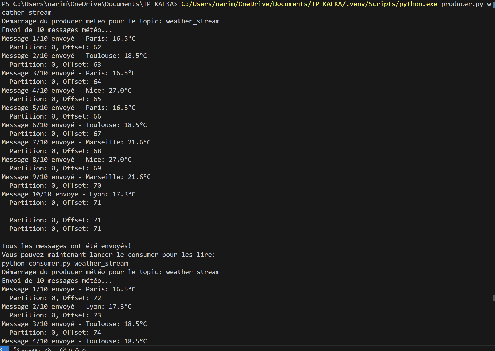

# Exercice 4 : Transformation avec Spark et alertes météo

## Principe
Le processeur lit les données météo depuis `weather_stream`, applique des règles d'alertes, et produit les données enrichies dans `weather_transformed`.

## Règles d'alertes
- **Vent** : level_0 (<10 m/s), level_1 (10-20 m/s), level_2 (>20 m/s)
- **Chaleur** : level_0 (<25°C), level_1 (25-35°C), level_2 (>35°C)

## Commandes

### 1. Créer le topic
```bash
docker exec kafka kafka-topics --create --topic weather_transformed --bootstrap-server localhost:9092 --partitions 3 --replication-factor 1
```

### 2. Lancer le processeur d'alertes
```bash
python weather_alert_processor.py
```

### 3. Envoyer données météo
```bash
python producer.py weather_stream
```

### 4. Voir les alertes
```bash
docker exec kafka kafka-console-consumer --bootstrap-server localhost:9092 --topic weather_transformed --from-beginning
```

## Résultats obtenus

### Producteur météo


### Processeur d'alertes  


## Validation
- Nice (27°C, 20 m/s) → Vent level_2, Chaleur level_1 
- Lyon (17.3°C, 4.8 m/s) → Aucune alerte 
- Paris (16.5°C, 17.9 m/s) → Vent level_1 seulement 