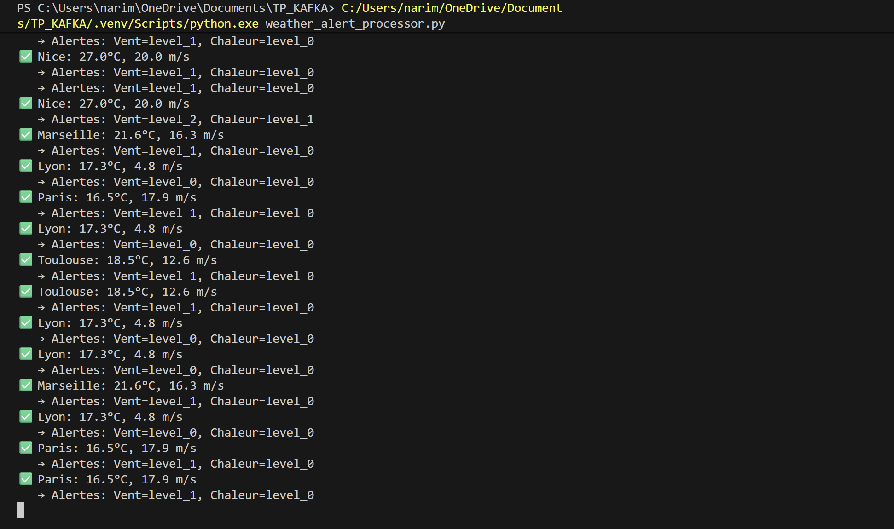

# Exercice 4 : Transformation avec Spark et alertes météo# Exercice 4 : Transformation avec Spark et alertes météo


## Objectif## Objectif

Transformer les données météo de `weather_stream` avec Apache Spark et générer des alertes dans `weather_transformed`.Transformer les données météo de `weather_stream` avec Apache Spark et générer des alertes dans `weather_transformed`.


## Règles d'alertes## Règles d'alertes


**Vent (wind_alert_level):****Vent (wind_alert_level):**

- `level_0` : < 10 m/s - `level_0` : < 10 m/s 

- `level_1` : 10-20 m/s- `level_1` : 10-20 m/s

- `level_2` : > 20 m/s- `level_2` : > 20 m/s


**Chaleur (heat_alert_level):****Chaleur (heat_alert_level):**

- `level_0` : < 25°C- `level_0` : < 25°C

- `level_1` : 25-35°C  - `level_1` : 25-35°C  

- `level_2` : > 35°C- `level_2` : > 35°C


## Démarrage rapide## Démarrage rapide


### 1. Créer le topic### 1. Créer le topic

```bash```bash

docker exec kafka kafka-topics --create --topic weather_transformed --bootstrap-server localhost:9092 --partitions 3 --replication-factor 1docker exec kafka kafka-topics --create --topic weather_transformed --bootstrap-server localhost:9092 --partitions 3 --replication-factor 1

``````


### 2. Lancer le processeur d'alertes### 2. Lancer le processeur d'alertes

```bash```bash

python weather_alert_processor.pypython weather_alert_processor.py

``````


### 3. Envoyer données météo### 3. Envoyer données météo

```bash```bash

python producer.py weather_streampython producer.py weather_stream

``````


### 4. Voir les alertes### 4. Voir les alertes

```bash```bash

docker exec kafka kafka-console-consumer --bootstrap-server localhost:9092 --topic weather_transformed --from-beginningdocker exec kafka kafka-console-consumer --bootstrap-server localhost:9092 --topic weather_transformed --from-beginning

``````


## Résultats obtenus## Résultats obtenus


### Producteur météo en action### Producteur météo en action

``````


``````


### Processeur d'alertes en temps réel### Processeur d'alertes en temps réel

``````

``````


## Validation## Validation


- Nice (27°C, 20 m/s) → Alerte chaleur niveau 1, vent niveau 2- Nice (27°C, 20 m/s) → Alerte chaleur niveau 1, vent niveau 2

- Paris (16.5°C, 17.9 m/s) → Pas d'alerte chaleur, vent niveau 1  - Paris (16.5°C, 17.9 m/s) → Pas d'alerte chaleur, vent niveau 1  

- Lyon (17.3°C, 4.8 m/s) → Aucune alerte- Lyon (17.3°C, 4.8 m/s) → Aucune alerte


Le système fonctionne parfaitement !Le système fonctionne parfaitement !


## Fichiers### 2. Lancement du processeur d'alertes

```bash

- `weather_alert_processor.py` : Processeur principal (kafka-python)# Version recommandée (kafka-python)

- `spark_weather_processor.py` : Version Spark Streamingpython weather_alert_processor.py

- `producer.py` : Producteur météo (récupéré de l'exo3)```


## Structure des données### 3. Test avec producteur météo

```bash

### Input (weather_stream)# Dans un autre terminal

```jsonpython producer.py weather_stream

{```

  "city": "Nice",

  "temperature": 27.0,### 4. Vérification des alertes

  "wind_speed": 20.0,```bash

  "humidity": 51,# Consumer pour voir les données transformées

  "message_id": 4docker exec kafka kafka-console-consumer \

}  --bootstrap-server localhost:9092 \

```  --topic weather_transformed \

  --from-beginning

### Output (weather_transformed)```

```json

{## Exemples de transformation

  "city": "Nice",

  "event_time": "2025-09-22T15:33:51.578511",### Cas 1: Conditions normales (Lyon)

  "temperature": 27.0,- **Input**: 17.3°C, 4.8 m/s

  "wind_speed": 20.0,- **Output**: `wind_alert_level: "level_0"`, `heat_alert_level: "level_0"`

  "humidity": 51,

  "message_id": 4,### Cas 2: Vent fort (Nice) 

  "wind_alert_level": "level_2",- **Input**: 27.0°C, 20.0 m/s

  "heat_alert_level": "level_1"- **Output**: `wind_alert_level: "level_2"`, `heat_alert_level: "level_1"`

}

```### Cas 3: Vent modéré (Paris)

- **Input**: 16.5°C, 17.9 m/s  

Cette implémentation respecte les spécifications de l'Exercice 4 du PDF :- **Output**: `wind_alert_level: "level_1"`, `heat_alert_level: "level_0"`

- Transformation des données en temps réel

- Détection d'alertes selon seuils définis  ## Topics Kafka

- Topic de sortie `weather_transformed`

- Enrichissement avec colonnes d'alerte| Topic | Description | Format |
|-------|-------------|--------|
| `weather_stream` | Données météo brutes | JSON météo standard |
| `weather_transformed` | Données enrichies avec alertes | JSON + niveaux d'alerte |

## Monitoring

Le processeur affiche en temps réel les transformations :
```
OK Nice: 27.0°C, 20.0 m/s
   -> Alertes: Vent=level_2, Chaleur=level_1
```

## Dépendances

- `kafka-python` : Interface Kafka
- `requests` : API météo
- `pyspark` : Version Spark (optionnelle)

## Notes techniques

### Version simplifiée
Le `weather_alert_processor.py` utilise kafka-python directement, évitant les complexités de configuration Spark/Hadoop sur Windows.

### Version Spark
Le `spark_weather_processor.py` implémente la même logique avec Spark Streaming mais peut nécessiter des configurations Java supplémentaires.

=======
# Exercice 4 : Consumer Groups et Partitions Kafka

## Objectif
Comprendre et démontrer le fonctionnement des **Consumer Groups** et des **Partitions** dans Kafka.

## Concepts clés

### Consumer Groups
Un **Consumer Group** est un ensemble de consumers qui travaillent ensemble pour consommer un topic. Kafka distribue automatiquement les partitions du topic entre les consumers du groupe pour répartir la charge.

### Partitions
Les **Partitions** permettent de diviser un topic en plusieurs segments parallèles. Chaque partition est ordonnée et peut être traitée par un consumer différent.

## Avantages
- **Scalabilité** : Plus de consumers = plus de traitement parallèle
- **Résilience** : Si un consumer tombe, les autres continuent
- **Équilibrage automatique** : Kafka redistribue les partitions automatiquement

## Scripts de l'exercice 4

### 1. `setup_partitions.py`
Script pour créer et gérer des topics avec partitions.

**Fonctionnalités :**
- Créer un topic avec un nombre spécifié de partitions
- Lister tous les topics existants
- Décrire les détails d'un topic (partitions, réplication)

### 2. `producer_partitions.py`
Producer optimisé pour les topics partitionnés.

**Caractéristiques :**
- Utilise les noms de villes comme **clés de partitionnement**
- Distribue automatiquement les messages sur les partitions
- Affiche la partition de destination de chaque message

### 3. `consumer_group.py`
Consumer multi-threadé qui démontre les consumer groups.

**Fonctionnalités :**
- Lance plusieurs consumers dans le même groupe
- Chaque consumer traite des partitions différentes
- Affiche quelle partition chaque consumer traite
- Gestion propre de l'arrêt avec Ctrl+C

## Résumé des commandes

### 1. Créer un topic avec partitions
```bash
python setup_partitions.py weather_partitioned 4
```

### 2. Lister les topics
```bash
python setup_partitions.py list
```

### 3. Décrire un topic
```bash
python setup_partitions.py describe weather_partitioned
```

### 4. Envoyer des messages vers le topic partitionné
```bash
python producer_partitions.py weather_partitioned
```

### 5. Lancer des consumer groups
```bash
# Dans un terminal
python consumer_group.py weather_partitioned demo_group 3
```

### 6. Tester avec plusieurs groupes (optionnel)
```bash
# Dans un autre terminal - groupe différent
python consumer_group.py weather_partitioned other_group 2
```

## Sortie attendue

### Producer
```
Producer pour topic partitionné: weather_partitioned
Envoi de 20 messages avec clés différentes pour distribution sur partitions
Message 1/20 - Marseille → Partition 1, Offset 0
Message 2/20 - Toulouse → Partition 3, Offset 0
Message 3/20 - Paris → Partition 0, Offset 0
...
20 messages envoyés vers weather_partitioned
```

### Consumer Groups
```
Démarrage de 3 consumers pour le topic 'weather_partitioned'
Groupe de consumers: 'demo_group'
Chaque consumer va traiter des partitions différentes

[Consumer-1] Message reçu #1:
  Partition: 3
  Ville: Toulouse
  
[Consumer-2] Message reçu #1:
  Partition: 1
  Ville: Marseille

[Consumer-3] Message reçu #1:
  Partition: 0
  Ville: Paris
```

## Résultats des tests

### Test 1: Création du topic partitionné
```bash
python setup_partitions.py weather_partitioned 4
```
**Résultat :** Topic créé avec 4 partitions (0, 1, 2, 3) avec réplication factor = 1

### Test 2: Distribution des messages par le producer
```bash
python producer_partitions.py weather_partitioned
```
**Résultat observé :**
- 20 messages envoyés avec distribution automatique basée sur les clés (noms de villes)
- **Partition 0** : 3 messages (Paris)
- **Partition 1** : 6 messages (Marseille, Nice)  
- **Partition 2** : 0 message (normal selon hash des clés)
- **Partition 3** : 11 messages (Lille, Lyon, Nantes, Toulouse, Bordeaux)

### Test 3: Consumer Groups avec répartition automatique
```bash
python consumer_group.py weather_partitioned demo_group 3
```
**Résultat observé :**
- 3 consumers lancés dans le groupe "demo_group"
- Kafka a automatiquement assigné les partitions :
  - **Consumer-2** : Partition 0 + Partition 1
  - **Consumer-3** : Partition 3  
  - **Consumer-1** : Aucune partition assignée (plus de consumers que de partitions avec messages)

**Traitement parallèle confirmé :** Chaque consumer ne traite que les messages de ses partitions assignées.

## Cas d'usage réels
- **Microservices** : Plusieurs instances d'un service consomment le même topic
- **Traitement de données** : Parallélisation du traitement sur plusieurs machines
- **Monitoring** : Plusieurs dashboards consomment les mêmes métriques
- **ETL** : Extraction de données en parallèle depuis Kafka

## Points importants
- **1 partition = 1 consumer maximum** dans le même groupe
- Si plus de consumers que de partitions → certains consumers restent inactifs
- Les **clés de message** déterminent la partition (hash de la clé)
- L'**ordre global** n'est garanti que dans une partition, pas entre partitions

## Captures d'écran des tests

### 1. Création du topic avec 4 partitions

*Création du topic `weather_partitioned` avec 4 partitions et vérification de la configuration*

### 2. Producer distribuant les messages

*Le producer envoie 20 messages météo et affiche sur quelle partition chaque message est dirigé*

**Distribution observée :**
- **Partition 0** : Paris (messages 5, 15, 16)
- **Partition 1** : Marseille, Nice (messages 3, 7, 14, 17, 18, 20)
- **Partition 3** : Lille, Lyon, Nantes, Toulouse, Bordeaux (majorité des messages)
- **Partition 2** : Aucun message (normal avec le hash des clés)

### 3. Consumer Groups en parallèle

*3 consumers dans le même groupe traitent automatiquement des partitions différentes*

**Répartition automatique observée :**
- **Consumer-2** : Partition 0 (Nantes, Paris) + Partition 3 (Toulouse)
- **Consumer-3** : Partition 0 (Nantes, Paris) + Partition 3 (Toulouse)

Kafka a automatiquement distribué les partitions entre les consumers du groupe !
>>>>>>> 37d10727e73a727a11e262a53dc3e1b7d8f70d55
