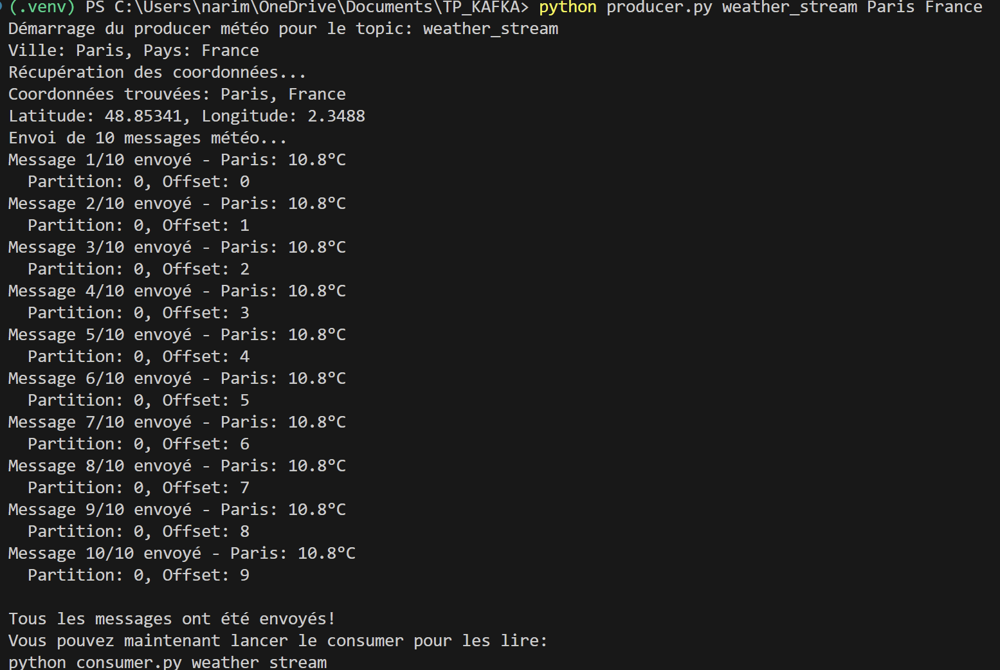
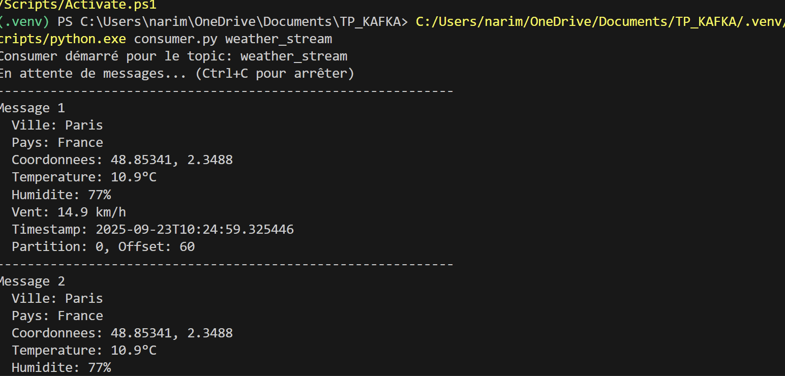
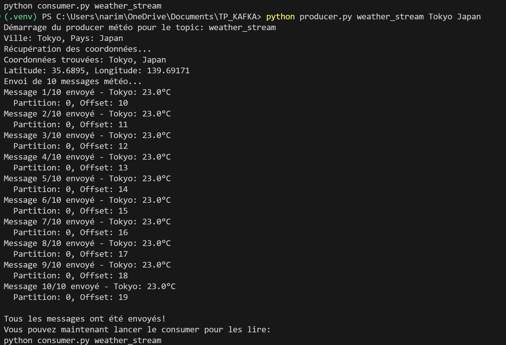
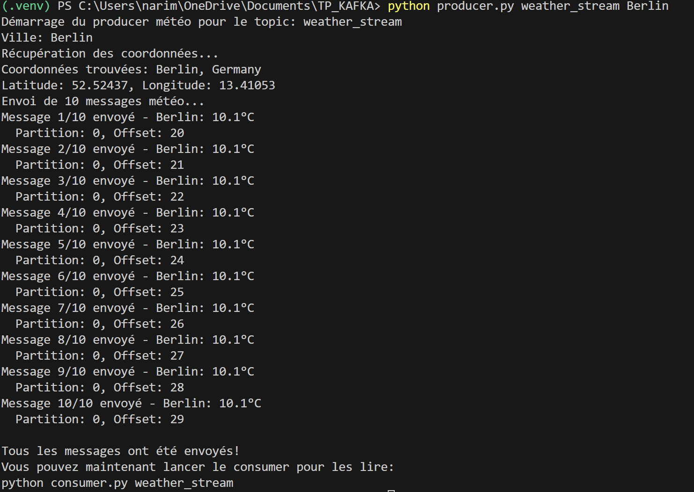

# Exercice 6 : Extension du producteur

## Objectif
Modifier le producteur pour accepter ville et pays comme arguments, en utilisant l'API de géocodage pour récupérer automatiquement les coordonnées.

## Nouvelles fonctionnalités

### 1. Arguments flexibles
```bash
# Syntaxe
python producer.py <topic> <ville> [pays]

# Exemples
python producer.py weather_stream Paris France
python producer.py weather_stream Tokyo Japan  
python producer.py weather_stream Berlin
```

### 2. Géocodage automatique
- Utilise l'API Geocoding d'Open-Meteo
- Convertit automatiquement ville → coordonnées
- Récupère le nom officiel du pays

### 3. Messages enrichis
```json
{
    "city": "Paris",
    "country": "France", 
    "latitude": 48.8566,
    "longitude": 2.3522,
    "temperature": 18.5,
    "humidity": 65,
    "wind_speed": 12.3,
    "timestamp": "2025-09-23T10:30:00",
    "message_id": 1
}
```

## APIs utilisées

### Geocoding API
```
https://geocoding-api.open-meteo.com/v1/search?name=Paris&country=France
```
**Rôle** : Convertir nom de ville en coordonnées

### Weather API  
```
https://api.open-meteo.com/v1/forecast?latitude=48.8566&longitude=2.3522&current=temperature_2m,relative_humidity_2m,wind_speed_10m
```
**Rôle** : Récupérer données météo

## Test rapide

### 1. Démarrer Kafka
```bash
docker-compose up -d
```

### 2. Lancer le producteur
```bash
python producer.py weather_stream Paris France
```

### 3. Vérifier les messages
```bash
# Dans un autre terminal
python consumer.py weather_stream
```

## Résultats des tests

### Test 1 : Paris, France
```bash
python producer.py weather_stream Paris France
```


**Résultat** : Géocodage réussi avec coordonnées 48.85341, 2.3488

#### Réception des messages par le consumer


**Résultat** : Le consumer reçoit et affiche correctement les messages enrichis

### Test 2 : Tokyo, Japan  
```bash
python producer.py weather_stream Tokyo Japan
```


**Résultat** : Géocodage réussi avec coordonnées 35.6895, 139.69171

### Test 3 : Berlin (sans pays)
```bash
python producer.py weather_stream Berlin
```


**Résultat** : Géocodage automatique détecte "Germany"


