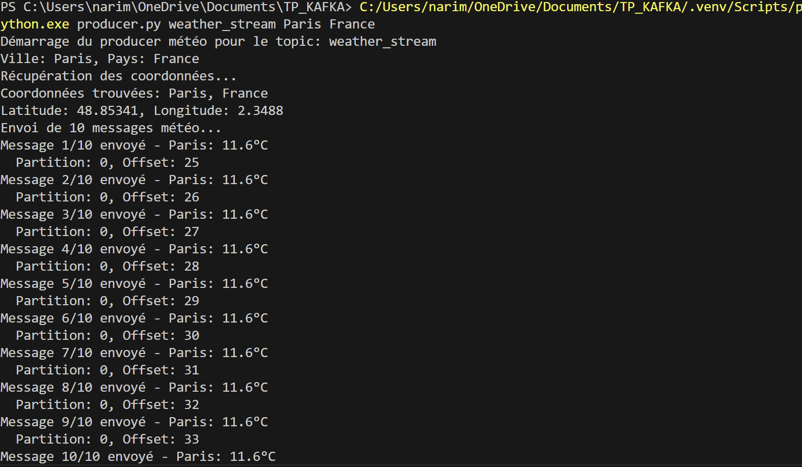
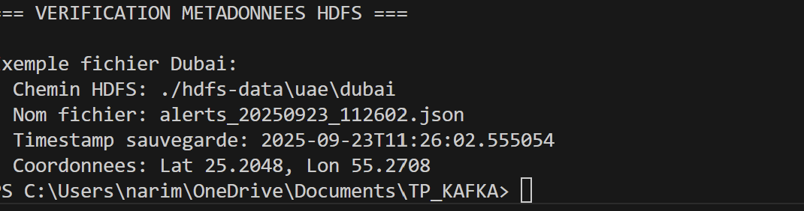

# Exercice 7 : HDFS Organisé - Pipeline d'Alertes Météo

## Logique du système

**Pipeline en 3 étapes :**
1. **Producer** → Génère données météo → Topic `weather_stream`
2. **Transformer** → Analyse seuils → Topic `weather_transformed` (avec alertes)
3. **HDFS Consumer** → Filtre alertes → Stockage organisé `/hdfs-data/{country}/{city}/`

**Seuils d'alertes :** Température >35°C/<-10°C, Humidité >85%, Vent >50km/h

**Filtrage intelligent :** Seuls les messages avec alertes sont sauvegardés dans HDFS

## Captures d'écran - Démonstration

### Test Producer


**Ce qu'on voit :** Le producer génère des conditions météo extrêmes pour déclencher les alertes automatiques.

### Structure HDFS Organisée  


**Ce qu'on voit :** La structure HDFS finale avec organisation automatique par pays/ville :
```
hdfs-data/
├── russia/yakutsk/alerts_*.json     → Alerte froid extrême (-15°C)
├── singapore/singapore/alerts_*.json → Alerte humidité (90%)  
├── uae/dubai/alerts_*.json          → Alerte chaleur (45°C)
└── usa/chicago/alerts_*.json        → Alerte vent fort (65 km/h)
```

**Résultat :** Chaque fichier contient uniquement les données avec alertes + géolocalisation + horodatage complet.